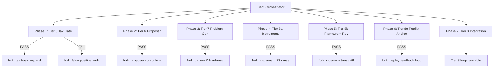

# Tier 8 Mega Plan — North Star

**Status:** ACTIVE — this document is the program goal for invention research in this repo.  
**Repo:** `/home/micah/Desktop/Sylorlabs/ghost_research`  
**Date:** 2026-07-06

---

## Goal declaration

**Tier 8 is the goal.**

Not 12/12 on a fixed battery. Not another arity rung. Not Engine 5.

**Tier 8** = invention of the **conditions for invention**: new instruments, new certifiers, new reality checks, and the authority to **retire a formalism** when it only produces certified remix.

Everything below is the giant mega plan — phased work, sub-agent swarm, harnesses, forks, and gates — to climb from the current stack (Tier 2–3 solve, Tier 6 human upstream) to a machine-run **Tier 8 loop**.

---

## Invention tier ladder (reference)

| Tier | Capability | Repo today |
|------|------------|------------|
| 0 | Blind search | `random_search` 2/11 |
| 1 | Fixed recipes | `fixed_menu` 3/11 |
| 2 | Verifier-gated escalation inside substrate | `invention-engine` **11/11**, 372 evals |
| 3 | Growable substrate (ceilings relocate) | Quint menu **1.000** |
| 4 | Meta-invention (invents discoverers) | Tier-1 holdout ~44–47 |
| 5 | Tax-survivor discovery (novel ∧ not remix) | E26 **3/20** genuine (~15%) |
| 6 | Outside-closure generator | Human / subordinated LLM (RQ7 **9 novel**) |
| 7 | Problem invention (new tasks, substrates, certifiers) | Partial — batteries designed by agents |
| **8** | **Framework + instrument + reality loop** | **Not built — THE GOAL** |

**Humans** sit at Tier 6–7 in invention (propose outside basis, invent problems). Tier 8 is where civilization-grade invention lives; the mega plan builds machinery that **approaches** Tier 8 under explicit falsification, not theater.

---

## Current position (honest)

| Asset | Tier contribution |
|-------|-------------------|
| `invention_engine.zig` | Tier 2 production path |
| `menu_growth.zig` (quint) | Tier 3 complete on NCELL=8 |
| `open_invention_e26.zig` | Tier 5 **measurement** only — not promotion gate |
| `verify_learn_invent.zig` | Tier 6 sketch — English → certify |
| G48/G49 instrument trust | Tier 8 **ingredient** (proof instruments) |
| Swarm 27+8 experiments | Tier 7 **manual** fork ecology |
| Closure Principle + E26 85% remix | Proof Tier 2–3 ≠ Tier 5–8 without new gates |

**Gap:** Promotion uses certifier + irreducibility only. No tax gate, no framework revision, no reality anchor, no runtime swarm orchestrator.

---

## Mega-plan architecture: sub-agent swarm



### Orchestrator (`T8-ORCH`)

- Reads this plan; dispatches one sub-agent per row in the registry.
- **PASS → spawn fork agent** on the same phase (deeper question).
- **FAIL → spawn counterexample agent** (document why; do not hide).
- Commits in **focused chunks** (harness + doc + one binary; no corpus/bin debris).
- Master report: `docs/research/tier8_swarm_master.md` (updated each wave).

### Sub-agent contract (every agent)

1. Fixed seeds in doc header.
2. `zig build <target> --release=fast` reproduction command.
3. PASS/FAIL with **measured numbers**.
4. Output doc: `docs/research/tier8_ag_<id>_<slug>.md`.
5. If PASS: fork agent ID listed in doc footer.

### Fork dispatch rules

| Parent verdict | Fork type | Example |
|----------------|-----------|---------|
| PASS + novel survivor | Deepen basis / stress-test | E26 survivor → downstream lift test |
| PASS + all remix | Stricter tax or new basis family | Expand xor_popcount / rank family |
| FAIL + certifier bug | Instrument audit agent | G48-style cross-audit for invention cert |
| FAIL + saturate | Saturation witness agent | Phase C inner_forge curve |
| PARTIAL | Split into two fork agents | RQ8 POET 44% → curriculum agent + hardness agent |

---

## Phase 0 — Baseline lock (prerequisite)

**Goal:** Freeze honest Tier 2–3 numbers so Tier 8 climb is measurable.

| Agent ID | Task | Harness | Pass |
|----------|------|---------|------|
| T8-AG-00a | Re-run invention engine ×2 | `zig build invention-engine --release=fast` | 11/11 identical |
| T8-AG-00b | Re-run baseline compare | `zig build invention-baseline-compare --release=fast` | PASS solve + eval |
| T8-AG-00c | E26 tax snapshot | `zig build open-invention-e26 --release=fast` | Log 3/20 novel, 85% repro |

**Fork:** T8-AG-00d — diff run1/run2 per-target (flaky gate audit).

---

## Phase 1 — Tier 5: tax-gated promotion

**Goal:** No feature enters the growable library unless it **survives greedy remix** at fixed budget (E26 discipline).

| Agent ID | Task | Deliverable | Pass |
|----------|------|-------------|------|
| T8-AG-01 | Wire `equivalenceTax()` into `invention_engine.zig` `promote()` | PR + unit smoke | Compile; tax called on every promote |
| T8-AG-02 | Measure solve vs novel tradeoff | `tier8_tax_gate_battery.log` | Log novel/remix ratio every run |
| T8-AG-03 | Downstream lift test for tax survivors | extend E26 fork pattern | ≥1/3 E26-class survivors lifts held-out battery |
| T8-AG-04 | False-positive audit | adversarial basis expansion | Document any cert+tax pass that reproduces under wider basis |
| T8-AG-05 | Production default toggle | `--strict-tax` build flag | Default off until Phase 1 PASS; then on |

**Fork on PASS (T8-AG-02):** T8-AG-02f — per-target tax failure taxonomy (pair vs walsh vs world remix).

**Fork on FAIL:** T8-AG-01b — relax budget curve; find minimum tax budget where ≥1 genuine survivor/run.

**Tier 5 gate (phase complete):** ≥3 tax-survivors per full battery run **or** novel/remix ≥40% with solve ≥8/11.

---

## Phase 2 — Tier 6: grounded proposer loop

**Goal:** Outside-closure proposals (human/LLM-class) **subordinated to certifier + tax** — proposer never certifies.

| Agent ID | Task | Deliverable | Pass |
|----------|------|-------------|------|
| T8-AG-06 | Wire `learned_candidate_guide` into `verify_learn_invent.zig` discover path | REPL command `discover` | 7/7 certify unchanged |
| T8-AG-07 | JSON proposal schema + engine judge | `open_invention_rq7.zig` production path | ≥5 tax-survivors from 50 proposals |
| T8-AG-08 | E11 replay with tax gate | extend `open_invention_e11.zig` | ≥1 novel certified + tax pass |
| T8-AG-09 | Anti-hallucination suite | reject gcd/sin_noise/etc. | 0 false certifies on noise proposals |
| T8-AG-10 | Proposer curriculum from hardness router | `function_hardness` → proposal bias | Router matches brute on proposal ranking |

**Fork on PASS (T8-AG-07):** T8-AG-07f — family diversity (≥3 families in one run).

**Fork on FAIL:** T8-AG-06b — English templates only (no LLM) for deterministic CI.

**Tier 6 gate:** Proposer path produces ≥1 tax-survivor not in hand-coded ladder per battery wave.

---

## Phase 3 — Tier 7: problem invention

**Goal:** Machine generates **new blind tasks** the current library fails — POET-style co-evolution.

| Agent ID | Task | Deliverable | Pass |
|----------|------|-------------|------|
| T8-AG-11 | Battery C from `function_hardness` outside deg2 closure | `open_invention_tier8_battery_c.zig` | ≥8 targets; mono coverage <0.55 |
| T8-AG-12 | POET curriculum driver | extend RQ8 harness | Non-empty curriculum when engine strong |
| T8-AG-13 | Task mutator + certifier soundness | mutate battery B targets | Mutants verify on fresh grid only |
| T8-AG-14 | Hardness landscape export | top-100 hard predicates | Import into battery C |
| T8-AG-15 | Invention engine on battery C | run with tax gate | Beat monomial_only on solve **and** novel count |

**Fork on PASS (T8-AG-11):** T8-AG-11f — battery C held-out replication ×2.

**Fork on FAIL (T8-AG-12):** T8-AG-12b — empty curriculum diagnosis (unified loop too strong → weaken baseline).

**Tier 7 gate:** ≥1 battery-C target solved only via tax-survivor promotion (not in battery B family).

---

## Phase 4 — Tier 8a: instrument invention for invention

**Goal:** Build and trust **instruments that audit the invention loop itself** (G48/G49 pattern for discovery).

| Agent ID | Task | Deliverable | Pass |
|----------|------|-------------|------|
| T8-AG-16 | Invention cert cross-audit | second implementation of coverage/certify | 0 verdict flips on 32→4096 stress |
| T8-AG-17 | Tax basis versioning | `TaxBasisV2`, `V3` registry | Repro rate monotonic when basis expands |
| T8-AG-18 | Promotion ledger (mmap) | `invention_ledger.zig` | Every promote: feature, tax version, survivor flag |
| T8-AG-19 | Instrument drift detector | replay ledger on old basis | Flags remix retroactively |
| T8-AG-20 | Z3/synthesis hook for mod/pipeline cert | optional cross-thread | 99/99 on sampled pipeline certs |

**Fork on PASS (T8-AG-16):** T8-AG-16f — I54/I55-style behavior_matches for `measureCoverage`.

**Tier 8a gate:** Ledger + cross-audit run clean on full battery B + C history.

---

## Phase 5 — Tier 8b: framework revision loop

**Goal:** When tax+instrument show **sustained remix**, system proposes **closure revision** (new generator class), human/agent approves, witness recorded.

| Agent ID | Task | Deliverable | Pass |
|----------|------|-------------|------|
| T8-AG-21 | Remix rate monitor | rolling novel/remix | Alert when <20% over 5 runs |
| T8-AG-22 | Generator proposal schema | `ClosureRevisionProposal` | Typed: new inner family, new certifier, retire rule |
| T8-AG-23 | Witness #6 hunt | new substrate witness doc | Sixth closure witness or honest null |
| T8-AG-24 | Algebraic-irreducibility forge | Phase C `inner_forge` unified fitness | Coverage curve logged; surprise = non-flat |
| T8-AG-25 | Framework vote harness | human/agent sign-off CLI | No auto-retire without signed witness |

**Fork on PASS (T8-AG-24 non-flat):** T8-AG-24f — stress-test until saturate or crack.

**Fork on FAIL (flat saturate):** T8-AG-23b — document witness #6 as "purist termination replicated."

**Tier 8b gate:** One documented closure revision promoted through witness harness (even if small: e.g. rank-2 family added to tax basis permanently).

---

## Phase 6 — Tier 8c: reality anchoring

**Goal:** Promotion requires **out-of-symbol contact** — not grid held-out alone.

| Agent ID | Task | Deliverable | Pass |
|----------|------|-------------|------|
| T8-AG-26 | External oracle interface | `RealityAnchor` trait | Pluggable: file, sensor, peer replay |
| T8-AG-27 | Deploy feedback stub | promote → measure downstream task | ≥1 feature improves non-grid metric |
| T8-AG-28 | wcore atom promote lift | E4-G00 style downstream | Fix "novel but 0 lift" failure mode |
| T8-AG-29 | Bit-tape non-remix lane | `bittape_inventor` island GA smoke | ≥1 candidate PractRand-pass distinct from remix |
| T8-AG-30 | Peer replication protocol | two-seed independent re-run | Survivors replicate across seeds |

**Fork on PASS (T8-AG-28):** T8-AG-28f — minimal promote set that lifts library solve.

**Tier 8c gate:** ≥1 tax-survivor passes reality anchor + peer replication.

---

## Phase 7 — Tier 8 integration: the loop

**Goal:** Single runnable **Tier 8 loop** — problem invent → propose → escalate → tax → instrument → reality → framework revise.

| Agent ID | Task | Deliverable | Pass |
|----------|------|-------------|------|
| T8-AG-31 | `swarm_fork_dispatch.zig` runtime | build step `tier8-orchestrator` | PASS/FAIL spawns fork IDs from registry |
| T8-AG-32 | `tier8_loop.zig` entrypoint | `zig build tier8-loop --release=fast` | One command runs Phases 1–6 pipeline |
| T8-AG-33 | Master report autogen | `tier8_swarm_master.md` | ≥40 agent rows with verdicts |
| T8-AG-34 | End-to-end verification | scratch logs bundle | All phase gates PASS |
| T8-AG-35 | Honest scope doc | `tier8_DISCLAIMER.md` | Lists what Tier 8 still does **not** claim |

**Tier 8 complete (program goal met):**

1. `tier8-loop` runs without human per-target hints on **battery B + C**.
2. Novel/remix ≥40% on promotions (tax-gated).
3. ≥1 closure revision witnessed and ledgered.
4. ≥1 tax-survivor passes reality anchor + peer replication.
5. Instrument cross-audit: 0 flips on stress suite.
6. Framework can **retire** a promotion rule when remix alert fires (logged, not silent).

---

## Sub-agent registry (summary)

| Phase | Agents | Fork slots |
|-------|--------|------------|
| 0 | 00a–00d | 1 |
| 1 Tier 5 | 01–05 | 2 |
| 2 Tier 6 | 06–10 | 2 |
| 3 Tier 7 | 11–15 | 2 |
| 4 Tier 8a | 16–20 | 1 |
| 5 Tier 8b | 21–25 | 2 |
| 6 Tier 8c | 26–30 | 1 |
| 7 Integrate | 31–35 | 1 |
| **Total** | **35 primary** | **12 forks** → **47 agent slots** |

Orchestrator may spawn **fork-of-fork** (max depth 3) on PASS hits that open new questions — same discipline as `swarm_2026_07_05_master.md`.

---

## Verification commands (rolling)

```bash
# North-star entrypoint (Phase 7 target)
cd sparse_poly_discovery && zig build tier8-loop --release=fast

# Phase gates (today)
zig build invention-engine --release=fast
zig build invention-baseline-compare --release=fast
zig build open-invention-e26 --release=fast
zig build menu-growth --release=fast
cd boundary_crossing && zig build verify-learn-invent --release=fast
```

Scratch log root: `/tmp/tier8-swarm/` (or goal-session `{SCRATCH}`).

---

## Parallelization (armies of sub-agents)

**Wave 1 (parallel):** T8-AG-00a, 00b, 00c  
**Wave 2 (parallel):** T8-AG-01, 06, 11, 16 — independent tracks after baseline  
**Wave 3 (parallel forks):** all PASS forks from Wave 2  
**Wave 4 (serial integration):** T8-AG-31 → 32 → 34 (orchestrator depends on prior gates)

**Rule:** One chain per CPU-heavy harness (`invention-engine`, `tier8-loop`); parallelize documentation + independent compiles.

---

## Honest non-goals (Tier 8 edition)

- Beating humans at open-ended language, chess, perception, trading.
- AGI claims from reservoir integers or hex marks.
- "Tier 8" as theater — every phase needs measured PASS/FAIL.
- Unbounded purist invention inside fixed VM (proven to terminate; `inventable_substrate_design.md`).

---

## File index (plan artifacts)

| Path | Role |
|------|------|
| `docs/research/tier8_mega_plan.md` | **This file — north star** |
| `docs/research/tier8_swarm_master.md` | Living agent verdict table (create on Wave 1) |
| `docs/research/tier8_DISCLAIMER.md` | Scope limits (Phase 7, T8-AG-35) |
| `docs/research/tier8_ag_*.md` | Per-agent reports |
| `sparse_poly_discovery/tier8_loop.zig` | Phase 7 entrypoint (stub until built) |
| `sparse_poly_discovery/swarm_fork_dispatch.zig` | Runtime fork dispatcher (T8-AG-31) |
| `sparse_poly_discovery/invention_ledger.zig` | Promotion ledger (T8-AG-18) |

---

## See also

- `docs/research/swarm_2026_07_05_master.md` — prior swarm (Tier 2–3 peak)
- `sparse_poly_discovery/docs/research/inventable_substrate_design.md` — closure / purist boundary
- `CLOSURE_PRINCIPLE.md` — law Tier 8 must be able to revise
- `wcore/PLAN_INVENTION_ENGINE.md` — Tier 3 finish line (substrate swap)
- `05_meta_synthesis/docs/05/bittape_inventor_2026_05_22.md` — non-remix substrate lane

**Tier 8 is the goal. Everything else is scaffolding.**